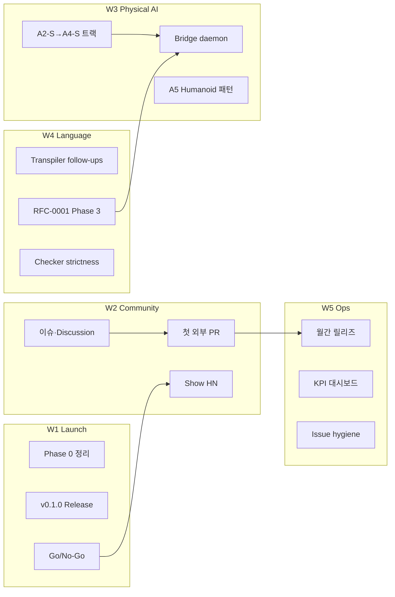

# Cell Coding 실행 계획 (발전판)

> [English first · EXECUTION_PLAN.en.md](EXECUTION_PLAN.en.md) · 한국어 병렬  
> **기반 문서:** [ROADMAP.md](ROADMAP.md) · [LAUNCH_CHECKLIST.md](.github/LAUNCH_CHECKLIST.md) · [RFC-0001](rfcs/RFC-0001-stream-membrane-physical-sla.md)  
> **최종 갱신:** 2026-07-07

---

## 1. 한 줄 요약

원래 90일 로드맵의 **기술 기반(0~60일)은 대부분 완료**되었고, 이제 **런칭 게이트 통과 → 커뮤니티 cold start → RFC-0001 Phase 3 릴리즈 트레인**으로 초점을 옮긴다.

The original 90-day roadmap’s **technical foundation (days 0–60) is largely complete**; focus shifts to **passing the launch gate → community cold start → RFC-0001 Phase 3 release train**.

---

## 2. 현재 상태 스냅샷

| 영역 | 원래 로드맵 구간 | 상태 | 근거 |
|------|------------------|------|------|
| Runtime (emit/on, membrane, immune, nervous) | Day 0–30 | ✅ 완료 | `typescript/runtime.ts`, 191 tests pass |
| Python bridge | Day 0–30 | ✅ 완료 | `bridge-python/`, robotics demos |
| Motion-alarm PoC | Day 0–30 | ✅ 완료 | `examples/motion-alarm/` |
| Viewer (React) | Day 31–60 | ✅ MVP | `viewer-react/`, `--json --watch` |
| E2E / CI | Day 31–60 | ✅ 동작 | GitHub Actions, observability compose |
| DSL subset + transpiler PoC | Day 61–90 | ✅ Phase 3 수준 | `transpiler.ts`, `--transpiled` |
| Physical AI 예제 트랙 A1–A5 | Day 61–90 | ✅ 문서·코드 | `examples/README.md` |
| Stream + Physical SLA (RFC-0001 Phase 2) | — | ✅ landed | A2-S / A3-S / A4-S organisms |
| **v0.1.0 npm 릴리즈** | Day 61–90 | ⏳ 대기 | LAUNCH Phase 1 |
| **이슈 정리 + starter 3~5개** | Day 0–30 | ⏳ 부분 | [ISSUE_CLEANUP.md](.github/ISSUE_CLEANUP.md) |
| **외부 기여자 10+ / PR 30+** | Day 61–90 | ⏳ 런칭 후 | 커뮤니티 KPI |

**판단:** “구현 가능한 프로젝트” 단계는 통과. 다음 병목은 **첫 실행 경로 검증**과 **기여 진입점 정리**다.

---

## 3. 작업 스트림 (5개 병렬 트랙)



| ID | 스트림 | 책임 | 다음 마일스톤 |
|----|--------|------|---------------|
| **W1** | 런칭 준비 | Maintainer | v0.1.0 태그 + 클린 머신 검증 |
| **W2** | 커뮤니티 | Maintainer + Core | Welcome Pin + good first issue 3개 |
| **W3** | Physical AI 레퍼런스 | Runtime + Bridge | Discussion #003 합의 → 이슈 #20·#21 |
| **W4** | DSL / RFC | Compiler | RFC-0001 Phase 3 umbrella 이슈 등록 |
| **W5** | 운영·품질 | Maintainer | 이슈 72h SLA, 월간 릴리즈 cadence |

---

## 4. 단계별 실행 계획

### Phase A — 런칭 게이트 (Day -2 ~ Day 0)

**목표:** 첫 방문자 5분 실행 · 기여자 30분 첫 PR

| # | 작업 | 산출물 | 완료 기준 | 의존 |
|---|------|--------|-----------|------|
| A.1 | 이슈 중복 정리 | 열린 starter 3~5개 | [ISSUE_CLEANUP.md](.github/ISSUE_CLEANUP.md) §6 체크 | — |
| A.2 | GitHub About + Discussions | Pin Welcome | LAUNCH Phase 0 표 전부 ☐→☑ | A.1 |
| A.3 | Secrets + v0.1.0 태그 | npm `@cell-coding/cli` | `npx` 클린 머신 성공 | A.2 |
| A.4 | README GIF + Social preview | 첫인상 자료 | Quick start 스크린샷 1장 | A.3 |
| A.5 | Go/No-Go 판정 | 홍보 시작 여부 | LAUNCH § Go 5항목 충족 | A.1–A.4 |

**No-Go 시 우회:** Secrets 없으면 README 상단에 **clone 경로** 임시 강조 (LAUNCH 1.7).

---

### Phase B — Cold start (Day 0 ~ Week 2)

**목표:** “살아 있는 저장소” 신호 + 첫 외부 기여 1건

| # | 작업 | 주기 | KPI |
|---|------|------|-----|
| B.1 | Issues / Discussions / HN 댓글 | 매일 15분 | 응답 ≤ 72h |
| B.2 | Show HN + Announcements | Day 0~1 | HN 댓글 24h 내 답변 |
| B.3 | Show and tell 데모 1개 | 1주 내 | motion-alarm trace 공유 |
| B.4 | 외부 PR merge 또는 constructive review | 2주 내 | ≥ 1건 |
| B.5 | Star cold start | 런칭 주 | 지인 5~10명 직접 공유 |

**커뮤니티 KPI (Phase B 종료 시):**

| 지표 | 목표 | 측정 |
|------|------|------|
| Quick start 성공률 | ≥ 90% | 클린 머신 3회 시도 |
| good first issue 오픈 수 | ≥ 3 | GitHub label 필터 |
| 첫 외부 PR | ≥ 1 | merge 또는 상세 리뷰 |
| Issue 첫 응답 | ≤ 72h | GitHub timestamp |

---

### Phase C — v0.2.x 실험 (Week 2 ~ Month 2)

**목표:** RFC-0001 실험 플래그 안정화 · Physical AI sim-real 트랙 합의

RFC-0001 §8 롤아웃 1단계에 대응한다.

| # | 작업 | 이슈 초안 | 완료 기준 |
|---|------|-----------|-----------|
| C.1 | Physical AI 트랙 커뮤니티 리뷰 | `19-physical-ai-sim-real-track` | Discussion #003 maintainer 요약 |
| C.2 | RFC-0001 Phase 3 umbrella 등록 | `21-rfc-0001-phase3-tracking` | GitHub 이슈 + RFC 헤더 링크 |
| C.3 | `holdLastSafe` 통합 테스트 | Phase 3 backlog | `physical-sla.test.ts` 확장 |
| C.4 | SECURITY.md EN 요약 | `07` / #25 | bilingual SECURITY |
| C.5 | Transpiler diagnostics | `14-transpiler-error-diagnostics` | 친절한 compile error |

**알려진 한계 — 합의 매트릭스 (Discussion #003):**

| 한계 | 단기 (v0.2) | 중기 (v0.3) | 장기 (v0.4+) |
|------|-------------|-------------|--------------|
| pulse마다 subprocess `cell run` | 문서화·수용 | bridge daemon (#20) | long-running runtime |
| multi-stream parallel inject | teaching-only 명시 | CLI co-inject | organism wiring syntax |
| DSL binary `-` 없음 | spec에 intentional omit | 또는 parser 추가 | — |
| PET TouchStream teaching-only | SCENARIO에 표기 | live adapter (A4-F) | — |

---

### Phase D — v0.3.x 기본 (Month 2 ~ Month 4)

**목표:** Stream/SLA 런타임 enforcement · Viewer physical meta

| # | 작업 | 산출물 | 검증 |
|---|------|--------|------|
| D.1 | `cell run --stream` batch 안정화 | CLI docs | A2-S / A3-S E2E |
| D.2 | SLA enforcement (staleness/rate/latency) | `physical-sla.ts` | synthetic overload test |
| D.3 | Viewer SLA UI | `viewer-react` | latencyMs / sensorAgeMs 표시 |
| D.4 | Bridge `ingestWallMs` staleness | `bridge-python` | `--staleness sensor\|ingest` |
| D.5 | Stream scheduler | runtime | declared rate ≠ manual interval only |

**릴리즈 기준 (v0.3.0):**

- [ ] A2-S, A3-S, A4-S `cell run` + bridge demo green
- [ ] RFC-0001 Phase 3 runtime 항목 50%+ 체크
- [ ] Breaking change 없음 (기존 `.cell` 컴파일 유지)

---

### Phase E — v0.4.x 생태계 (Month 4+)

**목표:** immune ↔ SLA 연동 · 분산 nervous · 외부 기여 루프 자립

| # | 작업 | 영역 |
|---|------|------|
| E.1 | immune ↔ SLA escalation | runtime |
| E.2 | multi-stream co-inject + daemon | bridge (#20) |
| E.3 | ROS2 live adapters 확장 | bridge + registry |
| E.4 | A5 Humanoid stream/SLA 패턴 | examples |
| E.5 | Cell Registry / cloud deploy PoC | Phase 4 CLI |
| E.6 | 월간 릴리즈 + CHANGELOG 자동화 | ops |

**커뮤니티 KPI (원 로드맵 Day 61–90 이관):**

| 지표 | 목표 |
|------|------|
| 외부 기여자 | 10+ |
| 외부 PR | 30+ |
| 월간 릴리즈 | 3회 연속 on-time |

---

## 5. Physical AI 학습 경로 (교육 트랙)

원 로드맵 “레퍼런스 예제 3+”를 **난이도·sim-real 계층**으로 확장한다.

```
A1 Porifera (3 cells)     — membrane·immune 입문
  ↓
A2 Spiderling (5)         — nervous 기초
  ↓
A2-S Sim (6 + IMU)        — stream·SLA 첫 접점  ← RFC-0001 PoC
  ↓
A3 Spider (10, 3 organs)  — multi-organ routing
  ↓
A3-S / A3-H Sim·Hardware  — VisionFrame + bridge
  ↓
A4 PET (11)               — affect + safety fallback
  ↓
A4-S / A4-H               — OwnerPing stream
  ↓
A5 Humanoid (14, 4 organs)— Phase E 타깃
```

**각 티어별 “완료” 정의:**

| 티어 | learner가 할 수 있는 것 | 검증 명령 |
|------|-------------------------|-----------|
| A1 | membrane pass/block 이해 | `cell run` porifera + `cell:test` |
| A2-S | stream inject + SLA trace 읽기 | `demo_spiderling_sim.py` |
| A3-S | multi-organ + stream 동시 | `spider-sim-organism.cell` |
| A4-S | immune fallback + comfort | `pet-sim-organism.cell` |
| A5 | (계획) proprioception stream | TBD — Discussion #003 합의 후 |

---

## 6. 기여자 진입 경로 (운영 플레이북)

### 6.1 Starter issue 파이프라인

```
issue-drafts/*.md  →  GitHub 등록 (1회)  →  PR merge  →  72h 내 close
```

**지금 등록 권장 (우선순위):**

1. #25 SECURITY EN (이미 open)
2. `14-transpiler-error-diagnostics.md`
3. `19-physical-ai-sim-real-track.md`
4. `21-rfc-0001-phase3-tracking.md`
5. `20-bridge-daemon-multistream.md` (중급)

### 6.2 PR 리뷰 SLA

| 유형 | 1차 응답 | 머지 목표 |
|------|----------|-----------|
| docs / good first issue | 72h | 7일 |
| runtime / compiler | 72h | 14일 |
| RFC / breaking | Discussion 먼저 | RFC Accepted 후 |

### 6.3 Maintainer 주간 루틴 (15분 × 5)

| 요일 | 작업 |
|------|------|
| 월 | 열린 이슈 스캔 — stale / duplicate |
| 화 | 외부 PR 1건 리뷰 |
| 수 | Discussion / HN 응답 |
| 목 | CI green 확인 |
| 금 | 로드맵·실행계획 체크박스 갱신 |

---

## 7. 릴리즈 트레인

| 버전 | 시기 (상대) | 핵심 내용 | 게이트 |
|------|-------------|-----------|--------|
| **v0.1.0** | Phase A | 첫 공개 npm, motion-alarm | 클린 머신 `npx` |
| **v0.1.x** | Phase B | hotfix, docs, GIF | CI green |
| **v0.2.0** | Phase C | RFC experimental, teaching track 합의 | Discussion #003 closed |
| **v0.3.0** | Phase D | SLA enforcement, Viewer meta | RFC Phase 3 50% |
| **v0.4.0** | Phase E | daemon, immune-SLA, A5 draft | 외부 PR ≥ 5 |

**월간 릴리즈 절차:** [.github/RELEASE.md](.github/RELEASE.md) — tag → Actions → npm/PyPI/VSCE.

---

## 8. 리스크 레지스터

| 리스크 | 영향 | 완화 |
|--------|------|------|
| npm Secrets 미설정 | 홍보 시 Quick start 실패 | clone 경로 임시 강조 + Phase A.3 우선 |
| 중복 good first issue | 기여자 혼란 | ISSUE_CLEANUP 즉시 실행 |
| teaching simplification 오해 | Physical AI 신뢰도 | SCENARIO “Known limits” + Discussion 합의 |
| subprocess per pulse 성능 | sim-real 데모 실패 | v0.2 문서화, v0.3 daemon (#20) |
| DSL transpiler 범위 creep | 머지 지연 | #24 follow-up만 (14–18), mega-issue 금지 |
| Maintainer 단일 병목 | 72h SLA 미달 | good first issue 비중 확대 |

---

## 9. 의사결정 대기 (오픈 질문)

| # | 질문 | 결정 경로 | 기한 |
|---|------|-----------|------|
| Q1 | linear teaching trace 수용 여부 | Discussion #003 | Phase C |
| Q2 | DSL `-` 연산 추가 vs spec omit | RFC 또는 이슈 #27 범위 | Phase C |
| Q3 | A5 Humanoid stream 진입점 | Community review | Phase E |
| Q4 | RFC-0001 → Accepted 시점 | Phase 3 50% 또는 명시적 defer | Phase D |

---

## 10. 다음 7일 액션 (체크리스트)

메인테이너가 **이번 주**에 할 일만 추린 목록이다.

- [ ] [ISSUE_CLEANUP.md](.github/ISSUE_CLEANUP.md) Step 1–3 실행 (completed + duplicate close)
- [ ] Welcome Discussion Pin + Physical AI #003 게시
- [ ] `gh` 또는 웹으로 starter 이슈 2건 등록 (14, 21)
- [ ] v0.1.0 태그 푸시 또는 clone 경로 README 강조 결정
- [ ] 클린 머신에서 `npx @cell-coding/cli run` 3회 검증
- [ ] README 상단 GIF 1장 추가 (viewer-react 또는 Jaeger)
- [ ] Go/No-Go 판정 기록 (LAUNCH §)

---

## 11. 문서 맵

| 문서 | 역할 |
|------|------|
| [ROADMAP.md](ROADMAP.md) | 90일 원본 목표 (역사적 기준) |
| **EXECUTION_PLAN.md** (본 문서) | 현재 상태 + 단계별 실행 |
| [LAUNCH_CHECKLIST.md](.github/LAUNCH_CHECKLIST.md) | Day -2~0 런칭 체크박스 |
| [PRESENTATION_OUTLINE.md](PRESENTATION_OUTLINE.md) | 대외 발표·데모 스크립트 |
| [RFC-0001](rfcs/RFC-0001-stream-membrane-physical-sla.md) | Stream/SLA 기술 방향 |
| [issue-drafts/](.github/issue-drafts/) | 기여 작업 backlog |

---

## 12. 갱신 규칙

1. **Phase 전환 시** — §2 스냅샷 표 갱신
2. **릴리즈 후 48h** — §7 릴리즈 트레인 체크
3. **월 1회** — §6 KPI + RFC Phase 3 umbrella 코멘트
4. **분기 1회** — ROADMAP.md와 정합성 검토 (90일 완료 시 차기 분기 로드맵 초안)
