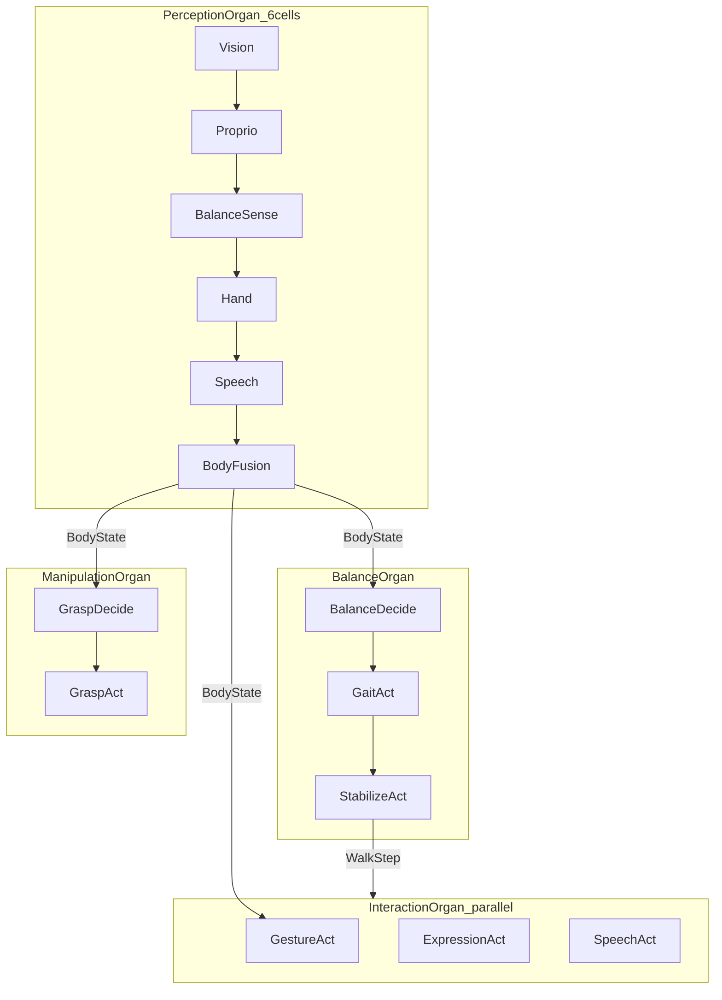

# Humanoid Robot · 휴머노이드 로봇

**Physical AI reference A5 · Physical AI 레퍼런스 A5**

Full README humanoid scenario: **vision, proprioception, balance, hand tactile, speech** → **bipedal locomotion, grasping, gestures, expression, speech** — as **cooperating organs**, not one controller pipeline.

README 휴머노이드: **시각·고유수용감각·균형·손 촉각·음성** → **이족 보행·파지·제스처·표정·발화** — 단일 컨트롤러가 아닌 **협업 기관**.

**Learning path · 학습 경로:** [A1](../porifera-filter/SCENARIO.md) → [A2](../spiderling/SCENARIO.md) → [A3](../spider-robot/SCENARIO.md) → [A4 PET](../pet-robot/SCENARIO.md) → **A5 Humanoid (this)**

---

## Why humanoid · 왜 휴머노이드

| Stage · 단계 | Reference · 레퍼런스 | Cells · 세포 | Organs · 기관 |
|-------------|---------------------|-------------|--------------|
| A1 | Porifera | 3 | 1 |
| A2 | Spiderling | 5 | 1 |
| A3 | Spider | 10 | 3 |
| A4 | PET | 11 | 3 |
| **A5 (this) · 지금** | **Humanoid** | **14** | **4** |

Humanoid is the **vertebrate-scale** reference: separate **balance**, **manipulation**, and **interaction** organs coordinated by `nervous MotorBus`.

휴머노이드는 **척추동물(Vertebrate) 계층** 레퍼런스로, **균형·조작·상호작용** 기관이 `nervous MotorBus`로 협업합니다.

---

## Architecture · 아키텍처



### Four organs · 4기관

| Organ · 기관 | Role · 역할 | Cells · 세포 | Exports · 내보냄 |
|-------------|------------|-------------|-----------------|
| `PerceptionOrgan` | Unified sensing · 통합 감각 | 6 (linear) | `BodyState` |
| `BalanceOrgan` | Bipedal locomotion · 이족 보행 | 3 (linear) | `WalkStep` |
| `ManipulationOrgan` | Grasping · 파지 | 2 (linear) | `GraspPulse` |
| `InteractionOrgan` | Gesture, face, speech · 제스처·표정·발화 | 3 (parallel) | `GesturePulse`, `FaceExpression`, `Utterance` |

### Nervous routing · 신경계

```
nervous MotorBus {
  PerceptionOrgan.BodyState -> BalanceOrgan
  PerceptionOrgan.BodyState -> ManipulationOrgan
  PerceptionOrgan.BodyState -> InteractionOrgan
  BalanceOrgan.WalkStep -> InteractionOrgan
}
```

`BodyState` fans out to three organs; `WalkStep` coordinates interaction (e.g. gesture while walking).

`BodyState`가 3기관으로 fan-out되고, `WalkStep`이 상호작용 기관과 보행을 조율합니다.

### Immune · 면역

`StabilizeActCell` emits `StabilityFault` on unstable steps; `HumanoidOrganism.immune StabilityPolicy` retries with exponential backoff.

---

## Cell catalog · 세포 목록 (14)

| Organ · 기관 | Cell | role (EN · KR) |
|-------------|------|----------------|
| Perception | `VisionSenseCell` | Vision and scene sensing · 시각·장면 감지 |
| Perception | `ProprioSenseCell` | Proprioception sensing · 고유수용감각 |
| Perception | `BalanceSenseCell` | Balance and tilt sensing · 균형·기울기 |
| Perception | `HandTactileCell` | Hand tactile sensing · 손 촉각 |
| Perception | `SpeechContextCell` | Speech context sensing · 음성 맥락 |
| Perception | `BodyFusionCell` | Unified body state fusion · 통합 신체 상태 |
| Balance | `BalanceDecideCell` | Bipedal balance decision · 이족 균형 판단 |
| Balance | `GaitActCell` | Bipedal gait execution · 이족 보행 실행 |
| Balance | `StabilizeActCell` | Posture stabilization · 자세 안정화 |
| Manipulation | `GraspDecideCell` | Grasp planning · 파지 계획 |
| Manipulation | `GraspActCell` | Hand grasp execution · 손 파지 실행 |
| Interaction | `GestureActCell` | Arm gesture · 팔 제스처 |
| Interaction | `ExpressionActCell` | Facial expression · 표정 |
| Interaction | `SpeechActCell` | Speech output · 발화 |

---

## vs A4 PET · A4 대비

| A4 PET | A5 Humanoid |
|--------|-------------|
| 11 cells, 3 organs | 14 cells, 4 organs |
| Home affect + safety | Body state + multi-organ motor |
| Follow / comfort | Walk / grasp / gesture / speech |
| 3 nervous routes | 4 nervous routes |

---

## Physical AI reference series complete · 레퍼런스 시리즈 완료

| Step | Example |
|------|---------|
| A1 | [Porifera](../porifera-filter/SCENARIO.md) |
| A2 | [Spiderling](../spiderling/SCENARIO.md) |
| A3 | [Spider](../spider-robot/SCENARIO.md) |
| A4 | [PET](../pet-robot/SCENARIO.md) |
| A5 | **Humanoid (this)** |

Next: Phase 2 **signal runtime** to execute these `.cell` graphs in simulation or hardware.

다음: Phase 2 **신호 런타임** — 시뮬·하드웨어에서 `.cell` 그래프 실행.

---

## Compile · 컴파일

Golden file: [`humanoid-organism.cell`](humanoid-organism.cell)

```bash
cd typescript && npm install && npm test
```

---

## Files · 파일

| File · 파일 | Purpose · 목적 |
|------------|---------------|
| `humanoid-organism.cell` | Golden `.cell` source (A5) |
| `SCENARIO.md` | This document |
