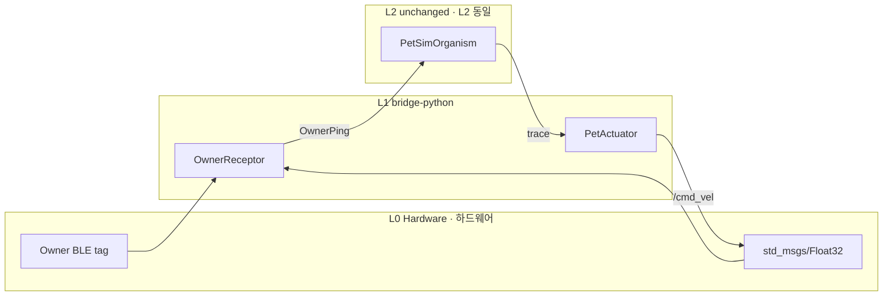

# PET Robot Hardware · 반려(PET) 로봇 하드웨어 (A4-H)

**Physical AI sim-real parity — L1 adapter swap · Physical AI sim-real parity — L1 어댑터 교체**

Uses the **same** [`pet-sim-organism.cell`](pet-sim-organism.cell) as [A4-S](SCENARIO.md). Only **L1 bridge** changes — BLE owner tag RSSI or ROS2 `std_msgs/Float32` → `OwnerPing`.

[A4-S](SCENARIO.md)와 **동일한** [`pet-sim-organism.cell`](pet-sim-organism.cell)을 사용합니다. 변경되는 것은 **L1 bridge만** — BLE owner tag RSSI 또는 ROS2 `std_msgs/Float32` → `OwnerPing`.

**Learning path · 학습 경로:** [A4](../pet-robot/SCENARIO.md) → [A4-S](SCENARIO.md) → **A4-H (this) · 지금** → [A5](../humanoid-robot/SCENARIO.md)

---

## Principle · 원칙

| Layer · 계층 | A4-S | A4-H |
|-------------|------|------|
| L0 | Mock owner tag · mock owner tag | BLE gateway / ROS2 RSSI topic |
| L1 | `simulate_owner_ping` | `OwnerReceptor(source=ros2\|ros2-replay)` |
| L2 | `PetSimOrganism` | **Same · 동일** `.cell` |

Keep organism, stream, and membrane SLA; **swap Receptor only**.

Organism·stream·membrane SLA는 그대로 두고, **Receptor만 교체**합니다.

---

## L1 adapters · L1 어댑터

| `--source` | Input · 입력 | Dependency · 의존성 |
|------------|-------------|---------------------|
| `sim` | mock RSSI | none · A4-S · (없음) |
| `ros2` | `std_msgs/Float32` on `/owner/rssi` | ROS2 + `rclpy` |
| `ros2-replay` | JSON fixture | none · CI/Windows demo · (없음) |

### OwnerPing mapping · 매핑

| Physical · 물리 | Cell signal | Field · 필드 |
|----------------|-------------|-------------|
| normalized BLE RSSI | `OwnerPing.rssi` | 0.0–1.0 |
| sample time | `OwnerPing.timestamp` | epoch ms (SLA staleness) |

Registry hint · 레지스트리: `OwnerPing` ↔ owner tag RSSI (see [`cell.sig.json`](../../registry/signals/robotics/cell.sig.json))

---

## Quick start · 빠른 시작

### 1) ROS2 replay (no ROS install · ROS 설치 없음)

```bash
cd bridge-python
python demo_pet.py --source ros2-replay
```

Fixture · 픽스처: [`fixtures/ros2-owner-ping-sample.json`](fixtures/ros2-owner-ping-sample.json)

Stale SLA demo (sensor timestamp in fixture — use with stream batch for enforcement):

Stale SLA demo · sensor timestamp fixture — stream batch와 함께 enforcement:

```bash
python demo_pet.py --source ros2-replay \
  --ros2-replay ../examples/pet-robot-sim/fixtures/ros2-owner-ping-stale.json \
  --cell ../examples/pet-robot-sim/pet-sim-organism.cell
```

Single `external` inject uses default **ingest staleness** mode; `stamp_ms` alone may not drop. For stream batch + old `timestamp` samples, see `physical-sla.test.ts`.

단일 `external` inject는 기본 **ingest staleness** 모드라 `stamp_ms`만으로는 drop되지 않을 수 있습니다. Stream batch + 오래된 `timestamp` 샘플은 `physical-sla.test.ts` 패턴을 참고하세요.

### 2) Owner stream replay (sequence · 시퀀스)

```bash
python demo_pet.py --source ros2-replay --samples 3 --interval-ms 500 \
  --replay-sequence ../examples/pet-robot-sim/fixtures/owner-ping-sequence.json
```

### 3) ROS2 live topic · ROS2 live 토픽

```bash
# After sourcing ROS env · ROS env source 후
source /opt/ros/humble/setup.bash
export ROS_DOMAIN_ID=0

python demo_pet.py --source ros2 --ros2-topic /owner/rssi
```

If no message within 5s, publish test data: `ros2 topic pub /owner/rssi std_msgs/Float32 "{data: 0.8}"`

토픽이 없으면 5초 타임아웃 — `ros2 topic pub /owner/rssi std_msgs/Float32 "{data: 0.8}"` 로 테스트하세요.

### 4) Actuator · FollowPulse → cmd_vel

```bash
python demo_pet.py --source sim --rssi 0.6 --publish-twist
python demo_pet.py --rssi 0.8 --publish-twist   # comfort only, no twist
python demo_pet.py --publish-twist --twist-sink ros2 --cmd-vel-topic /cmd_vel
```

`FollowPulse` → `TwistCommand` → ROS2 `geometry_msgs/Twist`. `VocalCue` / `ExpressionPulse` / `ComfortAction` are trace readback logs.

`FollowPulse` → `TwistCommand` → ROS2 `geometry_msgs/Twist`. `VocalCue` / `ExpressionPulse` / `ComfortAction`는 trace readback 로그.

### 5) A4 golden `.cell` (no stream · stream 없음)

```bash
python demo_pet.py --cell ../examples/pet-robot/pet-organism.cell --source sim --rssi 0.6 --publish-twist
```

---

## Architecture · 아키텍처



---

## Smoke test · 스모크

```bash
cd bridge-python
python demo_pet.py --source ros2-replay
python demo_pet.py --source sim --rssi 0.6 --publish-twist
python test_ros2_mapping.py
cd ../typescript && npm run cell:test -- ../examples/pet-robot/pet-organism.cell
```

---

## Not in scope (yet) · 미구현

- Live touch pad / microphone adapters (TouchStream remains teaching-only) · live touch/mic adapter (TouchStream은 teaching-only)
- Long-running bridge daemon · 상시 bridge daemon
- Multi-stream parallel inject (owner + touch + voice) · multi-stream parallel inject
