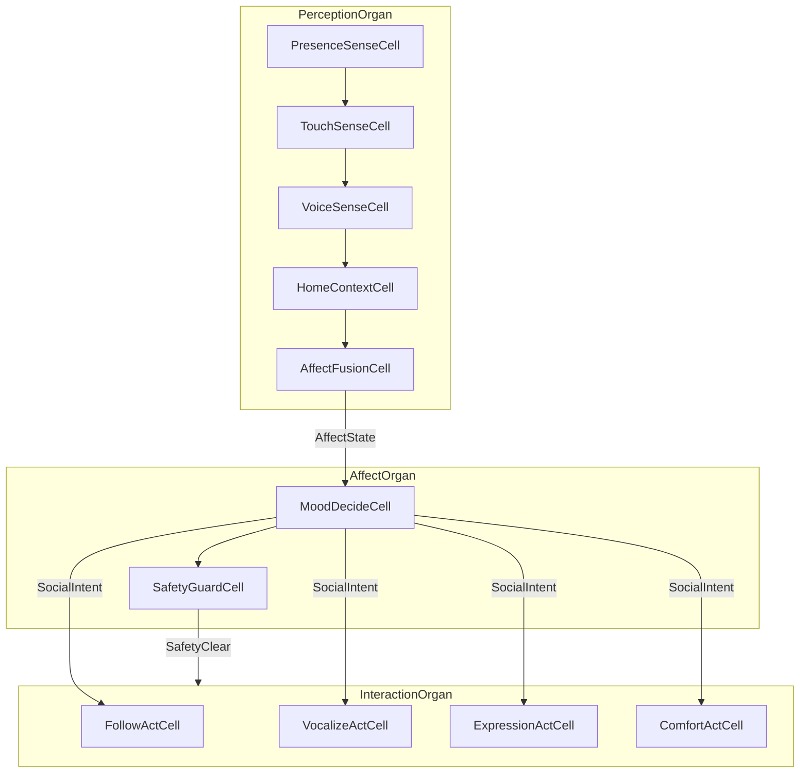

# PET Companion Robot · 반려(PET) 로봇

**Physical AI reference A4 · Physical AI 레퍼런스 A4**

Home companion PET robot: **owner presence, touch, voice tone, home context** → **follow, vocalize, tail/LED, comfort** — modeled as **affect and safety cells**, not discrete I/O.

가정용 반려(PET) 로봇: **주인 존재·터치·음성 톤·가정 맥락** → **따라가기·발성·꼬리/LED·위로** — 이산 I/O가 아닌 **정서·안전 세포 네트워크**.

**Learning path · 학습 경로:** [A1 Porifera](../porifera-filter/SCENARIO.md) → [A2 Spiderling](../spiderling/SCENARIO.md) → [A3 Spider](../spider-robot/SCENARIO.md) → **A4 PET (this)** → **[A4-S Sim](../pet-robot-sim/SCENARIO.md)** / **[A4-H](../pet-robot-sim/A4-H.md)**

---

## Why PET · 왜 PET

| Stage · 단계 | Reference · 레퍼런스 | Cells · 세포 | Focus · 초점 |
|-------------|---------------------|-------------|-------------|
| A1 | Porifera | 3 | Filter · 여과 |
| A2 | Spiderling | 5 | Terrain locomotion · 지형 보행 |
| A3 | Spider | 10 | Multi-sense + web/chemical · 다감각 |
| **A4 (this) · 지금** | **PET Companion** | **11** | **Affect + safety + home interaction · 정서·안전·가정** |

Unlike spider (threat + locomotion), PET emphasizes **continuous social context** and **safe comfort behaviors** in the home.

거미(위협·보행)와 달리 PET는 **연속적 social context**와 **안전한 위로 행동**이 핵심입니다.

---

## Architecture · 아키텍처



### Three organs · 3기관

| Organ · 기관 | Cells · 세포 | Exports · 내보냄 |
|-------------|-------------|-----------------|
| `PerceptionOrgan` | Presence, Touch, Voice, Home, AffectFusion (5) | `AffectState` |
| `AffectOrgan` | MoodDecide, SafetyGuard (2) | `SocialIntent`, `SafetyClear` |
| `InteractionOrgan` | Follow, Vocalize, Expression, Comfort (4, parallel) | `FollowPulse`, `VocalCue`, `ExpressionPulse`, `ComfortAction` |

### Nervous routing · 신경계

```
nervous AffectBus {
  PerceptionOrgan.AffectState -> AffectOrgan
  AffectOrgan.SocialIntent -> InteractionOrgan
  AffectOrgan.SafetyClear -> InteractionOrgan
}
```

### Immune · 면역

`PresenceSenseCell` emits `DistressSignal(reason: "lost_signal")` when owner RSSI is too low.  
`PetOrganism.immune SafetyPolicy` uses **fallback** to `ComfortAction` with linear backoff.

주인 신호 소실 시 `DistressSignal` → immune **fallback** → `ComfortAction` (위로 행동).

---

## Signal chain · 신호 연쇄

`OwnerPing.rssi`가 perception chain을 타고 `SocialIntent.mode`까지 전달됩니다.

| Stage | Signal | Teaching rule |
|-------|--------|---------------|
| L0 inject | `OwnerPing.rssi` | BLE / owner tag strength |
| Sense | `OwnerPresence.distance` | close if rssi > 0.7 |
| Sense | `TouchSignal.pressure` | high if close |
| Sense | `VoiceTone.calm` | calm if pressure > 0.5 |
| Context | `HomeContext.quiet` | mirrors voice calm |
| Affect | `AffectState.valence` | 0.75 if quiet, else 0.35 |
| Decide | `SocialIntent.mode` | comfort if valence > 0.5, else follow |

---

## Cell catalog · 세포 목록

| # | Cell | role (EN · KR) |
|---|------|----------------|
| 1 | `PresenceSenseCell` | Owner presence detection · 주인 존재 감지 |
| 2 | `TouchSenseCell` | Touch and petting sensing · 터치·쓰다듬기 감지 |
| 3 | `VoiceSenseCell` | Voice tone sensing · 음성 톤 감지 |
| 4 | `HomeContextCell` | Home ambient context · 가정 환경 맥락 |
| 5 | `AffectFusionCell` | Affect state fusion · 정서 상태 융합 |
| 6 | `MoodDecideCell` | Social intent from affect · 정서 기반 상호작용 의도 |
| 7 | `SafetyGuardCell` | Home safety guard · 가정 안전 가드 |
| 8 | `FollowActCell` | Owner following locomotion · 주인 따라가기 |
| 9 | `VocalizeActCell` | Responsive vocalization · 반응형 발성 |
| 10 | `ExpressionActCell` | Tail and LED expression · 꼬리·LED 표현 |
| 11 | `ComfortActCell` | Comfort and soothing behavior · 위로·안정 행동 |

---

## vs A3 Spider · A3 대비

| A3 Spider | A4 PET |
|-----------|--------|
| Threat / terrain | Affect / social intent |
| Web + chemical act | Follow + vocal + expression + comfort |
| `ThreatAssessment` | `AffectState` + `SocialIntent` |
| Sensor immune retry | Safety fallback to comfort |
| VisionFrame inject | OwnerPing inject |

---

## Growth path · 확장 경로

**A4-S Sim:** [PET Sim (stream + SLA + bridge)](../pet-robot-sim/SCENARIO.md)

**A4-H Hardware:** [BLE/RSSI bridge](../pet-robot-sim/A4-H.md)

**A5 Humanoid:** [Humanoid reference (14 cells, 4 organs)](../humanoid-robot/SCENARIO.md)

---

## Trace labs · trace 실험 (A4)

Golden file: [`pet-organism.cell`](pet-organism.cell)

### Lab 1 — close owner (comfort)

```bash
cd typescript
node --import tsx -e "import { runCellFile, formatRunHuman } from './run-cell.js'; const i={type:'OwnerPing',data:{rssi:0.8}}; console.log(formatRunHuman(runCellFile({file:'../examples/pet-robot/pet-organism.cell',input:i}),i));"
```

기대: `AffectState valence≈0.75` → `SocialIntent comfort` → **ComfortAction** + VocalCue/ExpressionPulse (FollowPulse 없음)

### Lab 2 — moderate signal (follow)

`rssi: 0.6` → `valence≈0.35` → `SocialIntent follow` → **FollowPulse**

```bash
cd bridge-python
python demo_pet.py --cell ../examples/pet-robot/pet-organism.cell --source sim --rssi 0.6
```

### Lab 3 — lost owner (immune fallback)

`rssi: 0.01` → `DistressSignal(reason: lost_signal)` → immune **ComfortAction** fallback

```bash
cd typescript
npm run cell:run -- ../examples/pet-robot/pet-organism.cell OwnerPing '{"rssi":0.01}'
```

### Lab 4 — A4-S / A4-H bridge (same cascade, L1 only)

```bash
cd bridge-python
python demo_pet.py --source ros2-replay
python demo_pet.py --source sim --rssi 0.6 --publish-twist
python demo_pet.py --source ros2-replay --samples 3 --interval-ms 500
```

[`pet-sim-organism.cell`](../pet-robot-sim/pet-sim-organism.cell) + SLA/onSample — cascade shape는 A4와 동일.

### Lab 5 — actuator (FollowPulse → cmd_vel)

L2 trace의 `FollowPulse`를 L1 `PetActuator`가 `geometry_msgs/Twist`로 매핑합니다. `VocalCue` / `ExpressionPulse` / `ComfortAction`는 로그 readback.

```bash
cd bridge-python
python demo_pet.py --rssi 0.6 --publish-twist
python demo_pet.py --rssi 0.8 --publish-twist   # comfort only, no twist
python demo_pet.py --publish-twist --twist-sink ros2 --cmd-vel-topic /cmd_vel
```

Mapping · 매핑: `FollowPulse.pace` → `linear.x = pace`.

---

## Compile · 컴파일

```bash
cd typescript && npm install && npm test
npm run cell:test -- ../examples/pet-robot/pet-organism.cell
npm run cell:test -- ../examples/pet-robot-sim/pet-sim-organism.cell
```

---

## Files · 파일

| File · 파일 | Purpose · 목적 |
|------------|---------------|
| `pet-organism.cell` | Golden `.cell` source (A4) |
| `pet-organism.celltest.json` | Cell Lab isolation tests |
| `SCENARIO.md` | This document |
| [`../pet-robot-s/`](../pet-robot-sim/) | A4-S sim + A4-H hardware bridge |
