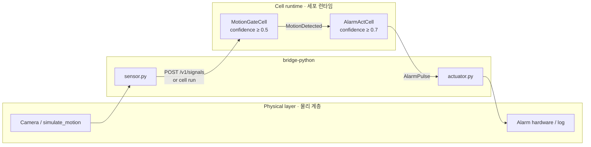

# Physical AI — Motion Alarm | 모션 알람

> **MotionDetected → AlarmPulse** · 카메라(센서) 입력 → 세포 연쇄 → 알람 액추에이터  
> Program: [`motion-alarm/motion-alarm.cell`](motion-alarm/motion-alarm.cell) · Python bridge: [`bridge-python/`](../bridge-python/)

---

## 5-minute quick start | 5분 빠른 시작

```bash
# 1) TypeScript runtime (local AST)
cd typescript && npm install
npm run cell:run -- ../examples/motion-alarm/motion-alarm.cell MotionDetected '{"x":150,"y":220,"confidence":0.98}'

# 2) Transpiled TS handlers (same trace)
npm run cell:run -- --transpiled ../examples/motion-alarm/motion-alarm.cell MotionDetected '{"x":150,"y":220,"confidence":0.98}'

# 3) Python bridge (local cell run)
cd ../bridge-python && python demo.py

# 4) Python bridge → cloud runtime (Docker motion-alarm organ :8087)
cd ../runtime-docker && docker compose up -d --build motion-alarm redis
cd ../bridge-python && python demo_cloud.py --url http://127.0.0.1:8087
```

Expected trace · 기대 연쇄:

```text
MotionDetected → MotionDetected → AlarmPulse
```

Expected alarm line · 기대 알람 출력:

```text
ALARM [triggered] from AlarmActCell @ …ms
```

Low confidence (`--confidence 0.3`) → **No alarm · 알람 없음**.

---

## Signal flow | 신호 흐름



| Stage | Cell | Threshold | Output |
|-------|------|-----------|--------|
| Gate · 게이트 | `MotionGateCell` | `confidence ≥ 0.5` | forwards `MotionDetected` |
| Actuator · 액추에이터 | `AlarmActCell` | `confidence ≥ 0.7` | `AlarmPulse(level: "triggered")` |

Organism layout · 유기체 구조:

```text
MotionAlarmOrganism
  └── AlarmOrgan
        └── AlarmTissue (linear)
              MotionGateCell → AlarmActCell
```

---

## Paths | 실행 경로

### A. `cell run` (TypeScript CLI)

Human-readable cascade · 사람이 읽기 쉬운 trace:

```bash
cd typescript
npm run cell:run -- ../examples/motion-alarm/motion-alarm.cell MotionDetected '{"x":150,"y":220,"confidence":0.98}'
```

JSON + Viewer bundle:

```bash
npm run cell:run -- --json ../examples/motion-alarm/motion-alarm.cell MotionDetected '{"x":150,"y":220,"confidence":0.98}'
```

Transpiled handlers (`--transpiled`) · AST interpreter 대신 TS handler:

```bash
npm run cell:run -- --transpiled ../examples/motion-alarm/motion-alarm.cell MotionDetected '{"x":150,"y":220,"confidence":0.98}'
```

### B. Python bridge (local)

Wraps `cell run --json` · `cell run --json` 래퍼:

```bash
cd bridge-python
python demo.py
python demo.py --transpiled
python demo.py --confidence 0.3    # gate blocks · 게이트 차단
```

### C. Python bridge → cloud runtime

HTTP `POST /v1/signals` to organ-scoped cloud serve:

```bash
# motion-alarm Docker (:8087)
docker compose -f runtime-docker/docker-compose.yml up -d motion-alarm redis
cd bridge-python
python demo_cloud.py --url http://127.0.0.1:8087

# or env default for motion-alarm
set CELL_CLOUD_URL=http://127.0.0.1:8087
python demo_cloud.py
```

Cloud response includes `trace`, optional `otel` spans (`CELL_OTEL=true`), and Prometheus metrics at `GET /metrics`.

### D. Cell Lab tests

Sidecar: [`motion-alarm.celltest.json`](motion-alarm/motion-alarm.celltest.json)

```bash
cd typescript
npm run cell:test -- ../examples/motion-alarm/motion-alarm.cell
```

---

## Threshold scenarios | 임계값 시나리오

| `confidence` | MotionGateCell | AlarmActCell | Result |
|--------------|----------------|--------------|--------|
| `0.98` | pass | fire | `AlarmPulse` |
| `0.55` | pass | skip | no alarm |
| `0.30` | skip | skip | no alarm |

---

## Architecture notes | 설계 메모

- **Membrane contract** · 막 계약: each cell declares `accepts` / `emits`; runtime enforces routing.
- **Tissue linear flow** · 조직 선형 흐름: `MotionGateCell → AlarmActCell` in one tissue.
- **Physical AI boundary** · 물리 경계: Python only simulates sensor/actuator; business logic stays in `.cell`.
- **Future** · 확장: replace `simulate_motion` with camera stream; drive GPIO/buzzer from `extract_alarm_actions`.

---

## Related docs | 관련 문서

| Link | Description |
|------|-------------|
| [`examples/README.md`](README.md) | All examples · 전체 예제 |
| [`bridge-python/README.md`](../bridge-python/README.md) | Python API |
| [`runtime-docker/README.md`](../runtime-docker/README.md) | Cloud runtime Docker |
| [`cell-coding.html`](../cell-coding.html) | Language overview |
| [`roadmap.html`](../roadmap.html) | Implementation roadmap |

---

## 한국어 요약

**Physical AI PoC**는 “센서 신호 → 세포 프로그램 → 액추에이터” 경계를 분리합니다.

1. **`.cell`** — `MotionGateCell` / `AlarmActCell` 로 판단·방출 로직 정의  
2. **`bridge-python`** — `simulate_motion()` 으로 `MotionDetected` 주입, trace에서 `AlarmPulse` 추출  
3. **cloud runtime** — organ 단위 HTTP 서버(`CELL_ORGAN=AlarmOrgan`)로 동일 연쇄를 원격 실행  

신규 기여자는 위 **5분 빠른 시작** 4줄만 실행하면 전체 파이프라인을 재현할 수 있습니다.
