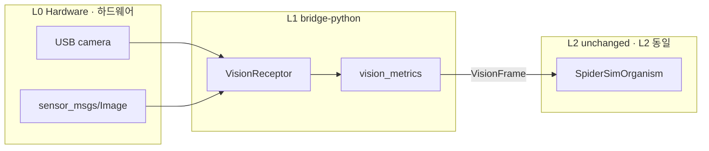

# Spider Robot Hardware · 거미 로봇 하드웨어 (A3-H)

**Physical AI sim-real parity — L1 adapter swap · Physical AI sim-real parity — L1 어댑터 교체**

Uses the **same** [`spider-sim-organism.cell`](spider-sim-organism.cell) as [A3-S](SCENARIO.md). Only **L1 bridge** changes — USB camera or ROS2 `sensor_msgs/Image` → `VisionFrame`.

[A3-S](SCENARIO.md)와 **동일한** [`spider-sim-organism.cell`](spider-sim-organism.cell)을 사용합니다. 변경되는 것은 **L1 bridge만** — camera 또는 ROS2 `sensor_msgs/Image` → `VisionFrame`.

**Learning path · 학습 경로:** [A3](../spider-robot/SCENARIO.md) → [A3-S](SCENARIO.md) → **A3-H (this) · 지금** → [A4](../pet-robot/SCENARIO.md)

---

## Principle · 원칙

| Layer · 계층 | A3-S | A3-H |
|-------------|------|------|
| L0 | Mock / Gazebo · mock / Gazebo | USB camera / robot camera topic |
| L1 | `simulate_vision_frame` | `VisionReceptor(source=camera\|ros2)` |
| L2 | `SpiderSimOrganism` | **Same · 동일** `.cell` |

Keep organism, stream, and membrane SLA; **swap Receptor only**.

Organism·stream·membrane SLA는 그대로 두고, **Receptor만 교체**합니다.

---

## L1 adapters · L1 어댑터

| `--source` | Input · 입력 | Dependency · 의존성 |
|------------|-------------|---------------------|
| `sim` | mock contrast/motion | none · A3-S · (없음) |
| `camera` | OpenCV `VideoCapture` | `pip install cell-coding-bridge[camera]` |
| `ros2` | `sensor_msgs/Image` topic | ROS2 + `rclpy` |
| `ros2-replay` | JSON fixture | none · CI/Windows demo · (없음) |

### VisionFrame mapping · 매핑

| Physical · 물리 | Cell signal | Field · 필드 |
|----------------|-------------|-------------|
| grayscale std dev | `VisionFrame.contrast` | 0.0–1.0 |
| frame diff mean | `VisionFrame.motion` | 0.0–1.0 |
| sample time | `VisionFrame.timestamp` | epoch ms (SLA staleness) |

Registry ROS2 hint · 레지스트리: `VisionFrame` ↔ `sensor_msgs/Image` (see [`cell.sig.json`](../../registry/signals/robotics/cell.sig.json))

---

## Quick start · 빠른 시작

### 1) ROS2 replay (no ROS install · ROS 설치 없음)

```bash
cd bridge-python
python demo_spider_sim.py --source ros2-replay
```

Fixture · 픽스처: [`fixtures/ros2-image-sample.json`](fixtures/ros2-image-sample.json) (fresh timestamp at run)

Stale SLA demo · stale SLA demo:

```bash
python demo_spider_sim.py --source ros2-replay --ros2-replay ../examples/spider-robot-sim/fixtures/ros2-image-stale.json
```

### 2) USB camera (A3-H)

```bash
pip install cell-coding-bridge[camera]
python demo_spider_sim.py --source camera --camera-index 0
python demo_spider_sim.py --source camera --samples 5 --interval-ms 33
```

### 3) ROS2 live topic · ROS2 live 토픽

```bash
# After sourcing ROS env · ROS env source 후 (Linux example · Linux 예시)
source /opt/ros/humble/setup.bash
export ROS_DOMAIN_ID=0

python demo_spider_sim.py --source ros2 --ros2-topic /camera/image_raw
```

If no topic within 5s, check with `ros2 topic list`.

토픽이 없으면 5초 타임아웃 후 오류 — `ros2 topic list`로 확인하세요.

### 4) Actuator · PathCommand → cmd_vel

```bash
python demo_spider_sim.py --source sim --motion 0.3 --publish-twist
python demo_spider_sim.py --source sim --motion 0.8 --publish-twist   # retreat + WebSpan
python demo_spider_sim.py --publish-twist --twist-sink ros2 --cmd-vel-topic /cmd_vel
```

`PathCommand` → `TwistCommand` → ROS2 `geometry_msgs/Twist`. `WebSpan` / `ChemicalPulse` / `StanceHold` are trace readback logs.

`PathCommand` → `TwistCommand` → ROS2 `geometry_msgs/Twist`. `WebSpan` / `ChemicalPulse` / `StanceHold`는 trace readback 로그.

### 5) Same organism · TypeScript direct inject · 동일 organism · TypeScript 직접 inject

```bash
cd typescript
npm run cell:run -- ../examples/spider-robot-sim/spider-sim-organism.cell VisionFrame \
  '{"contrast":0.6,"motion":0.3,"timestamp":1710000000123}'
```

---

## Architecture · 아키텍처



Python API:

```python
from cell_bridge import VisionReceptor, run_cell_file, extract_spider_actions

receptor = VisionReceptor(source="ros2-replay", ros2_replay_path="fixtures/ros2-image-sample.json")
frame = receptor.read_frame()
payload = run_cell_file("examples/spider-robot-sim/spider-sim-organism.cell", frame["type"], frame["data"])
print(extract_spider_actions(payload))
```

---

## ROS2 fixture format · ROS2 fixture 형식

```json
{
  "width": 8,
  "height": 8,
  "encoding": "mono8",
  "stamp_ms": 1710000000123,
  "data_base64": "..."
}
```

Supported encodings · 지원 encoding: `mono8`, `rgb8`, `bgr8`

---

## Tests · 테스트

```bash
cd bridge-python
python test_vision_metrics.py
python demo_spider_sim.py --source ros2-replay
```

---

## Files · 파일

| File · 파일 | Purpose · 목적 |
|------------|---------------|
| [`../../bridge-python/cell_bridge/vision_receptor.py`](../../bridge-python/cell_bridge/vision_receptor.py) | L1 VisionReceptor |
| [`../../bridge-python/cell_bridge/vision_metrics.py`](../../bridge-python/cell_bridge/vision_metrics.py) | contrast/motion + ROS decode |
| [`../../bridge-python/demo_spider_sim.py`](../../bridge-python/demo_spider_sim.py) | `--source` CLI |
| [`fixtures/ros2-image-sample.json`](fixtures/ros2-image-sample.json) | ROS2 replay sample |
| [`spider-sim-organism.cell`](spider-sim-organism.cell) | Shared L2 organism · 공유 L2 organism |

---

## Next · 다음

- **A3-F:** tactile/chemical channels (ContactStream adapter) · tactile/chemical 채널 (ContactStream adapter)
- **cloud:** `POST /v1/signals` with VisionFrame from edge receptor · edge receptor VisionFrame cloud ingress
