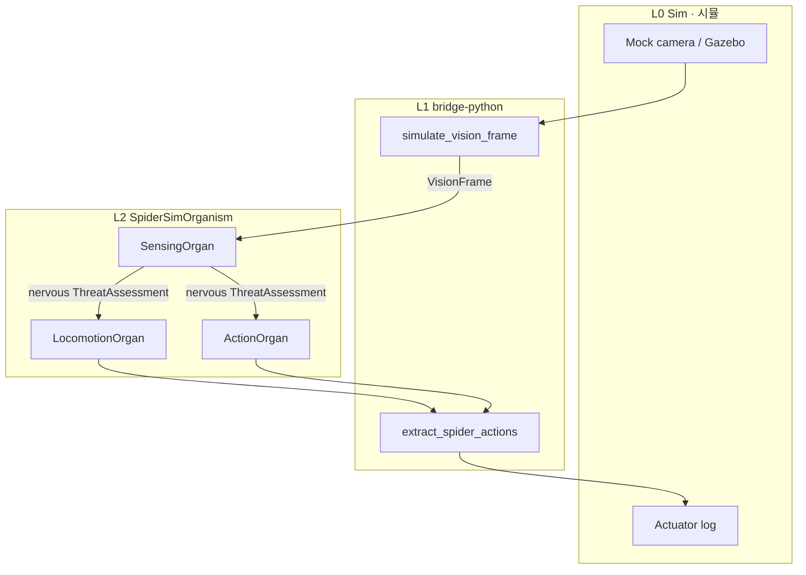

# Spider Robot Sim · 거미 로봇 시뮬 (A3-S)

**Physical AI sim-real parity · Physical AI sim-real parity**

Same **10 cells · 3 organs · nervous** as [A3 Spider](../spider-robot/SCENARIO.md), plus RFC-0001 Phase 2 (`stream`, membrane SLA, `onSample`).

[A3 Spider](../spider-robot/SCENARIO.md)와 **동일한 10세포·3기관·nervous** 구조에 RFC-0001 Phase 2(`stream`, membrane SLA, `onSample`)를 적용한 sim-real 레퍼런스입니다.

**Learning path · 학습 경로:** [A1](../porifera-filter/SCENARIO.md) → [A2](../spiderling/SCENARIO.md) → [A2-S](../spiderling-sim/SCENARIO.md) → [A3](../spider-robot/SCENARIO.md) → **A3-S (this) · 지금** → **[A3-H](A3-H.md)** → [A4](../pet-robot/SCENARIO.md) → [A5](../humanoid-robot/SCENARIO.md)

---

## Why A3-S · 왜 A3-S

| Stage · 단계 | Inject · 주입 | Notes · 특징 |
|-------------|--------------|-------------|
| A3 | `VisionFrame` | Compile · nervous reference · 컴파일·nervous 레퍼런스 |
| **A3-S (this) · 지금** | `VisionFrame` via sim bridge | Stream decl + membrane SLA + `onSample` · stream 선언 + membrane SLA + `onSample` |
| **[A3-H](A3-H.md)** | camera / ROS2 adapter | **Same `.cell`** — L1 bridge swap only · **동일 `.cell`**, L1 bridge만 교체 |

A3-S shows how to declare Physical AI **operating contracts** without changing organism structure.

A3-S는 **organism 구조를 바꾸지 않고** Physical AI 운영 계약(stream rate, latency budget)을 선언하는 방법을 보여줍니다.

---

## Streams · 스트림 선언

```cell
stream VisionStream {
  rate: 30Hz;
  sample: VisionFrame;
}

stream ContactStream {
  rate: 100Hz;
  sample: ContactEvent;
}
```

Bridge injects `VisionFrame` via **`cell run --stream`** (batch) or single **`external`** inject. Runtime enforces staleness / rate / latency; Viewer shows trace metadata.

Bridge는 **`cell run --stream`** (batch) 또는 단일 inject(`external`)로 `VisionFrame`을 주입합니다. Runtime SLA enforcement: staleness/rate/latency + Viewer trace.

---

## Entry cell SLA · 진입 세포 SLA

`VisionSenseCell` membrane (RFC-0001 experimental):

| Field · 필드 | Value · 값 | Meaning · 의미 |
|-------------|-----------|----------------|
| `latency: budget` | 33ms | ~30Hz vision budget · ~30Hz vision 예산 |
| `rate: max` | 30Hz | Aligned with VisionStream · VisionStream과 정합 |
| `staleness: reject` | 100ms | Drop stale frames · runtime enforced · stale frame drop |
| `onViolation` | holdLastSafe | Fail-safe on contract breach · 계약 위반 시 fail-safe |

Handler: `onSample(VisionFrame frame)` — stream sample receive pattern · stream sample 수신 패턴.

### Causality note · 인과 관계 (teaching simplification · 교육용 단순화)

This PoC cascade is a **linear teaching trace**, not multimodal fusion.

이 PoC cascade는 **multimodal fusion이 아니라 linear teaching trace**입니다.

| Declared · 선언 | Actual trace · 실제 trace |
|----------------|--------------------------|
| `ContactStream` / `ContactEvent` | **Unused** on this path · 이 cascade 경로에 **미사용** |
| `TactileSenseCell` | Accepts `VisualCue` (not tactile stream) · `VisualCue`를 받음 (실제 촉각 stream 아님) |
| Sensing organ | Sequential vision → hearing → chemical (not parallel fusion) · vision → hearing → chemical **순차** |

For real robots: **parallel stream inject** per sense organ + **fusion cell** in Decide organ. A3-S is a **membrane SLA + stream + nervous wiring** reference.

로봇 적용 시: sense organ별 **parallel stream inject** + Decide organ **fusion cell**으로 재구성하세요. A3-S는 **membrane SLA + stream + nervous wiring** 레퍼런스입니다.

---

## Architecture · 아키텍처



---

## Quick start · 빠른 시작

```bash
# TypeScript runtime
cd typescript && npm install
npm run cell:run -- ../examples/spider-robot-sim/spider-sim-organism.cell VisionFrame '{"contrast":0.6,"motion":0.3}'

# Stream batch (single runtime session · 단일 런타임 세션)
npm run cell:run -- --stream VisionStream --samples 3 --interval-ms 33 ../examples/spider-robot-sim/spider-sim-organism.cell VisionFrame '{"contrast":0.6,"motion":0.3}'

# Python bridge
cd ../bridge-python
python demo_spider_sim.py
python demo_spider_sim.py --contrast 0.05   # SensorFault path
python demo_spider_sim.py --samples 3 --interval-ms 33

# A3-H hardware (same .cell · 동일 .cell)
python demo_spider_sim.py --source ros2-replay
pip install cell-coding-bridge[camera]
python demo_spider_sim.py --source camera --camera-index 0

# Viewer JSON
cd ../typescript
npm run cell:run -- --json --out ../viewer/live-run.json ../examples/spider-robot-sim/spider-sim-organism.cell VisionFrame '{"contrast":0.6,"motion":0.3}'
```

**Expected trace · 기대 trace (threat scenario · 위협 시나리오):**

```text
VisionFrame → VisualCue → … → ThreatAssessment → PathCommand → … → StanceHold
                                                      ├→ WebSpan
                                                      └→ ChemicalPulse
```

---

## vs A3 · A3 대비

| | A3 | A3-S |
|---|-----|------|
| Cells / organs · 세포/기관 | 10 / 3 | Same · 동일 |
| Nervous · 신경계 | EventBus × 2 | Same · 동일 |
| Streams · 스트림 | — | VisionStream, ContactStream |
| Vision handler | `on(VisionFrame)` | `onSample(VisionFrame)` + SLA |
| Bridge demo | — | `demo_spider_sim.py` |

---

## Files · 파일

| File · 파일 | Purpose · 목적 |
|------------|---------------|
| `spider-sim-organism.cell` | A3-S golden source · A3-S golden 소스 |
| `SCENARIO.md` | This document · 이 문서 |
| [`A3-H.md`](A3-H.md) | Hardware / ROS2 bridge · 하드웨어 / ROS2 bridge |
| [`../../bridge-python/demo_spider_sim.py`](../../bridge-python/demo_spider_sim.py) | Sim bridge demo |
| [`../../rfcs/RFC-0001-stream-membrane-physical-sla.md`](../../rfcs/RFC-0001-stream-membrane-physical-sla.md) | Stream + SLA spec |

---

## Compile · 컴파일

```bash
cd typescript && npm test
```
