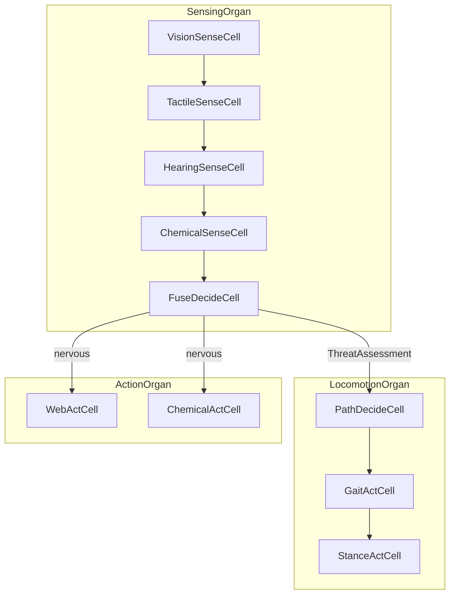

# Spider Robot · 거미 로봇

**Physical AI reference A3 · Physical AI 레퍼런스 A3**

Full README scenario as compilable `.cell`: **10 cells**, **3 organs**, **`nervous` routing** between organs.  
README **거미 로봇** 시나리오를 컴파일 가능한 `.cell`로 구현: **10세포**, **3기관**, 기관 간 **`nervous` 라우팅**.

**Learning path · 학습 경로:** [A1 Porifera](../porifera-filter/SCENARIO.md) → [A2 Spiderling](../spiderling/SCENARIO.md) → **A3 Spider (this)**

---

## Why full spider · 왜 full 거미

| Stage · 단계 | Reference · 레퍼런스 | Cells · 세포 | Tier · 계층 |
|-------------|---------------------|-------------|------------|
| A1 | Porifera Filter Bot | 3 | MICROBE |
| A2 | Spiderling Bot | 5 | PLANKTON |
| **A3 (this) · 지금** | **Spider Robot** | **10** | **INSECT** |
| A4 | Humanoid / PET | organ scale | — |

README describes a spider robot with **vision, hearing, tactile, chemical** inputs and **locomotion, web, chemical** outputs — not a single I/O pipeline. A3 models that as **organ clusters** connected by **signals and nervous routes**.

README는 **시각·청각·촉각·화학** 입력과 **보행·거미줄·화학** 출력을 단일 파이프라인이 아닌 **기관 클러스터 + nervous 라우팅**으로 표현합니다.

---

## Architecture · 아키텍처



### Three organs · 3기관

| Organ · 기관 | Tissue · 조직 | Cells · 세포 | Exports · 내보냄 |
|-------------|--------------|-------------|-----------------|
| `SensingOrgan` | `SensingTissue` (linear) | Vision, Tactile, Hearing, Chemical, Fuse | `ThreatAssessment` |
| `LocomotionOrgan` | `LocomotionTissue` (linear) | PathDecide, GaitAct, Stance | `StanceHold` |
| `ActionOrgan` | `ActionTissue` (parallel) | WebAct, ChemicalAct | `WebSpan`, `ChemicalPulse` |

### Nervous routing · 신경계 라우팅

```
nervous EventBus {
  SensingOrgan.ThreatAssessment -> LocomotionOrgan
  SensingOrgan.ThreatAssessment -> ActionOrgan
}
```

`ThreatAssessment` is the **cross-organ signal** — sensed threat drives locomotion and action organs in parallel, without direct cell-to-cell calls across organ boundaries.

`ThreatAssessment`는 **기관 간 신호**입니다. 감지된 위협이 보행·행동 기관에 동시에 전달되며, 기관 경계를 넘을 때 세포가 서로를 직접 호출하지 않습니다.

---

## Cell catalog · 세포 목록

| # | Cell | Sense/Decide/Act | role (EN · KR) |
|---|------|------------------|----------------|
| 1 | `VisionSenseCell` | Sense | Vision frame sensing · 시각 프레임 감지 |
| 2 | `TactileSenseCell` | Sense | Tactile contact sensing · 촉각 접촉 감지 |
| 3 | `HearingSenseCell` | Sense | Vibration and audio sensing · 진동·청각 감지 |
| 4 | `ChemicalSenseCell` | Sense | Chemical scent sensing · 화학 후각 감지 |
| 5 | `FuseDecideCell` | Decide | Multi-sense threat fusion · 다중 감각 위협 융합 |
| 6 | `PathDecideCell` | Decide | Terrain-adaptive path routing · 지형 적응 경로 판단 |
| 7 | `GaitActCell` | Act | Leg gait execution · 다리 보행 실행 |
| 8 | `StanceActCell` | Act | Posture stabilization · 자세 안정화 |
| 9 | `WebActCell` | Act | Web generation and anchoring · 거미줄 생성·고정 |
| 10 | `ChemicalActCell` | Act | Chemical spray action · 화학 분사 행동 |

---

## vs A2 Spiderling · A2 대비

| A2 Spiderling | A3 Spider |
|---------------|-----------|
| 5 cells, 1 organ | 10 cells, 3 organs |
| Tactile + terrain only | Vision + hearing + tactile + chemical |
| Linear locomotion only | Locomotion + parallel action |
| No nervous | `nervous EventBus` cross-organ routes |
| PLANKTON | INSECT |

---

## Immune · 면역

`VisionSenseCell` emits `SensorFault` on low contrast; `SpiderOrganism.immune SensorPolicy` retries with exponential backoff (same pattern as A1 Porifera).

---

## Growth path · 확장 경로

**A3-S Sim:** [Spider Sim (stream + SLA + bridge)](../spider-robot-sim/SCENARIO.md)

**A4 PET:** [PET Companion reference (11 cells, affect + safety)](../pet-robot/SCENARIO.md)

**A4 PET:** [반려(PET) 레퍼런스 (11세포, 정서·안전)](../pet-robot/SCENARIO.md)

**A5 Humanoid:** Balance, manipulation, speech organs — README Humanoid scenario.

---

## Trace labs · trace 실험 (A3)

Golden file: [`spider-organism.cell`](spider-organism.cell)

`VisionFrame.motion`이 sensing chain을 타고 `ThreatAssessment.level`까지 전달됩니다 (vision → cue → threat → hazard → level).

### Lab 1 — calm (forward + chemical)

```bash
cd typescript
node --import tsx -e "import { runCellFile, formatRunHuman } from './run-cell.js'; const i={type:'VisionFrame',data:{contrast:0.6,motion:0.3}}; console.log(formatRunHuman(runCellFile({file:'../examples/spider-robot/spider-organism.cell',input:i}),i));"
```

기대: `ThreatAssessment level≈0.35` → `PathCommand forward` + **ActionOrgan `ChemicalPulse`**

### Lab 2 — high motion (retreat + web)

`motion: 0.8` → `ThreatAssessment level≈0.8` → `PathCommand retreat` + **ActionOrgan `WebSpan`**

### Lab 3 — A3-H bridge (same cascade, L1 only)

```bash
cd bridge-python
python demo_spider_sim.py --source ros2-replay    # fixture → VisionFrame
python demo_spider_sim.py --source sim --motion 0.8
```

[`spider-sim-organism.cell`](../spider-robot-sim/spider-sim-organism.cell) + SLA/onSample — cascade shape는 A3와 동일.

### Lab 4 — dark frame (immune only)

`contrast: 0.05` → `SensorFault` → immune retry/backoff, locomotion 없음.

### Lab 5 — actuator (PathCommand → cmd_vel)

L2 trace의 `PathCommand`를 L1 `TwistActuator`가 `geometry_msgs/Twist`로 매핑합니다. `WebSpan` / `ChemicalPulse` / `StanceHold`는 로그 readback.

```bash
cd bridge-python
# calm · forward + chemical
python demo_spider_sim.py --source sim --motion 0.3 --publish-twist

# high threat · retreat + web
python demo_spider_sim.py --source sim --motion 0.8 --publish-twist

# A3 golden .cell (same actuator path)
python demo_spider_sim.py --cell ../examples/spider-robot/spider-organism.cell --source sim --motion 0.8 --publish-twist

# live ROS2 (requires sourced ROS + pip install cell-coding-bridge[ros2])
python demo_spider_sim.py --publish-twist --twist-sink ros2 --cmd-vel-topic /cmd_vel
```

Mapping · 매핑: `forward` → `linear.x = +speed`, `retreat` → `linear.x = -speed`, `left`/`right` → `angular.z`.

---

## Compile · 컴파일

---

## Files · 파일

| File · 파일 | Purpose · 목적 |
|------------|---------------|
| `spider-organism.cell` | Golden `.cell` source (A3) |
| `SCENARIO.md` | This document |
