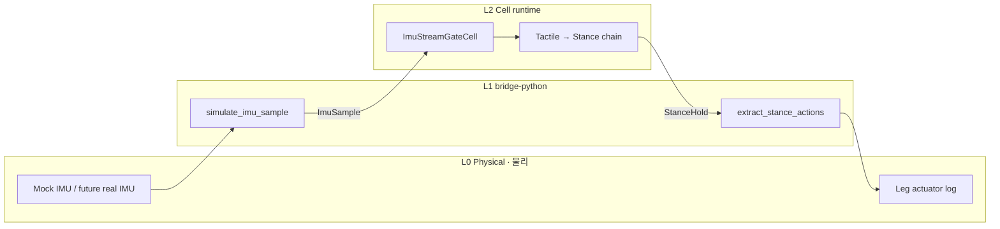

# Spiderling Sim · 거미 새끼 시뮬 (A2-S)

**Physical AI bridge reference · Physical AI 브리지 레퍼런스**

[A2 Spiderling](../spiderling/SCENARIO.md) 다음 단계: **IMU 샘플 inject → 보행 연쇄 → StanceHold**.  
RFC-0001 PoC — Stream/Pulse 게이트 패턴과 registry 표준 신호를 실제로 실행합니다.

**학습 경로:** [A1](../porifera-filter/SCENARIO.md) → [A2 Spiderling](../spiderling/SCENARIO.md) → **A2-S Sim (this)** → [A3 Spider](../spider-robot/SCENARIO.md)

---

## Why A2-S · 왜 A2-S

| 단계 | 내용 | 새로운 축 |
|------|------|-----------|
| A2 | spiderling-organism.cell (ContactEvent) | 5세포, PLANKTON |
| **A2-S (this)** | IMU bridge + ImuStreamGateCell | L1 Bridge → L2 Organism |
| A3 | 3 organs + nervous | 기관 간 라우팅 |

A2는 `ContactEvent`를 **직접 inject**합니다. A2-S는 **registry `ImuSample`** 을 bridge가 주입하고, `ImuStreamGateCell`이 domain pulse(`ContactEvent`)로 변환합니다 — sim/real parity의 첫 패턴입니다.

---

## Architecture · 아키텍처



| Layer | Component | Role |
|-------|-----------|------|
| L0 | Mock IMU | accel/gyro 샘플 생성 |
| L1 | `cell_bridge.sensor` | `ImuSample` payload |
| L2 | `ImuStreamGateCell` | Stream sample → `ContactEvent` |
| L2 | A2 locomotion chain | Tactile → Terrain → Path → Gait → Stance |

Registry 표준 타입: [`registry/signals/robotics/base.cell`](../../registry/signals/robotics/base.cell)

---

## Quick start · 빠른 시작

```bash
# 1) TypeScript runtime
cd typescript && npm install
npm run cell:run -- ../examples/spiderling-sim/spiderling-sim-organism.cell ImuSample '{"timestamp":1,"accelX":0.1,"accelY":0.2,"accelZ":9.81,"gyroX":0,"gyroY":0,"gyroZ":0.05}'

# 2) Python bridge demo
cd ../bridge-python
python demo_spiderling_sim.py
python demo_spiderling_sim.py --source ros2-replay
python demo_spiderling_sim.py --source ros2-replay --samples 5 --publish-twist

# Bridge details · L1 mapping: [BRIDGE.md](BRIDGE.md)

# 3) Multi-sample stream (single runtime session)
cd ../typescript
npm run cell:run -- --stream ImuStream --samples 5 --interval-ms 50 ../examples/spiderling-sim/spiderling-sim-organism.cell ImuSample '{"timestamp":1,"accelX":0.1,"accelY":0.2,"accelZ":9.81,"gyroX":0,"gyroY":0,"gyroZ":0.05}'

# 3b) Python bridge — same via cell run --stream
cd ../bridge-python
python demo_spiderling_sim.py --samples 5 --interval-ms 50

# 4) Viewer JSON
cd ../typescript
npm run cell:run -- --json --out ../viewer/live-run.json ../examples/spiderling-sim/spiderling-sim-organism.cell ImuSample '{"timestamp":1,"accelX":0.1,"accelY":0.2,"accelZ":9.81,"gyroX":0,"gyroY":0,"gyroZ":0.05}'
```

Expected trace · 기대 연쇄:

```text
ImuSample → ContactEvent → TactilePing → TerrainScan → PathCommand → GaitStep → StanceHold
```

---

## Cell catalog · 세포 목록

| # | Cell | Layer | role (KR) |
|---|------|-------|-----------|
| 0 | `ImuStreamGateCell` | Bridge gate | IMU `accelZ` → 접촉 압력·zone 매핑 |
| 1 | `TactileSenseCell` | Sense | 촉각 접촉 감지 |
| 2 | `TerrainSenseCell` | Sense | 지형 경사·마찰 |
| 3 | `PathDecideCell` | Decide | 경로·보행 라우팅 |
| 4 | `GaitActCell` | Act | 다리 보행 실행 |
| 5 | `StanceActCell` | Act | 자세 안정화 |

### vs A2 Spiderling · A2 대비

| A2 | A2-S |
|----|------|
| 5 cells | 6 cells (+ ImuStreamGateCell) |
| inject `ContactEvent` | inject `ImuSample` |
| no bridge | Python bridge demo |
| — | registry `@signals/robotics-base` |

---

## RFC-0001 notes · RFC 메모

- **Phase 2 landed:** `stream` / `onSample` parser + runtime SLA enforcement
- Trace `physical`: `latencyMs`, `sensorAgeMs`, `streamSeq`, `slaViolations` — Viewer Timeline에 표시
- **Stream batch:** `cell run --stream [StreamName] --samples N --interval-ms ms` — 단일 런타임 세션에서 주기 inject

---

## Files · 파일

| File | Purpose |
|------|---------|
| `spiderling-sim-organism.cell` | Golden `.cell` (6 cells) |
| `SCENARIO.md` | This document |
| `../../bridge-python/demo_spiderling_sim.py` | Bridge demo |
| `../../registry/signals/robotics/base.cell` | Standard signal types |

---

## Compile · 컴파일

```bash
cd typescript && npm test
```
